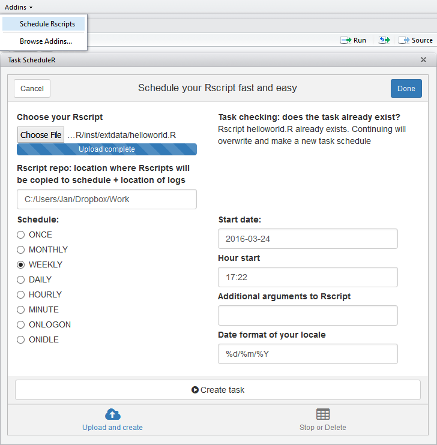

taskscheduleR
=========

 

Schedule R scripts/processes with the Windows task scheduler. This allows R users working on Windows to automate R processes on specific timepoints from R itself.
Mark that if you are looking for a Linux/Unix scheduler, you might be interested in the R package cronR available at https://github.com/bnosac/cronR


Basic usage
-----------

This R package allows to 
* Get the list of scheduled tasks
* Remove a task
* Add a task
  + A task is basically a script with R code which is run through Rscript
  + You can schedule tasks 'ONCE', 'MONTHLY', 'WEEKLY', 'DAILY', 'HOURLY', 'MINUTE', 'ONLOGON', 'ONIDLE'
  + The task log contains the stdout & stderr of the Rscript which was run on that timepoint. This log can be found at the same folder as the R script

Example usage:

```
library(taskscheduleR)
myscript <- system.file("extdata", "helloworld.R", package = "taskscheduleR")

## run script once within 62 seconds
taskscheduler_create(taskname = "myfancyscript", rscript = myscript, 
                     schedule = "ONCE", starttime = format(Sys.time() + 62, "%H:%M"))

## Run every day at the same time on 09:10, starting from tomorrow on
## Mark: change the format of startdate to your locale if needed (e.g. US: %m/%d/%Y)
taskscheduler_create(taskname = "myfancyscriptdaily", rscript = myscript, 
                     schedule = "DAILY", starttime = "09:10", startdate = format(Sys.Date()+1, "%d/%m/%Y"))

## Run every week on Saturday and Sunday at 09:10
taskscheduler_create(taskname = "myfancyscript_sunsat", rscript = myscript, 
                     schedule = "WEEKLY", starttime = "09:10", days = c('SUN', 'SAT'))

## Run every 5 minutes, starting from 10:40
taskscheduler_create(taskname = "myfancyscript_5min", rscript = myscript,
                     schedule = "MINUTE", starttime = "10:40", modifier = 5)

## Run every minute, giving some command line arguments
taskscheduler_create(taskname = "myfancyscript_withargs_a", rscript = myscript,
                     schedule = "MINUTE", rscript_args = "productxyz 20160101")
taskscheduler_create(taskname = "myfancyscript_withargs_b", rscript = myscript,
                     schedule = "MINUTE", rscript_args = c("productabc", "20150101"))


## get a data.frame of all tasks
tasks <- taskscheduler_ls()
str(tasks)

## delete the tasks
taskscheduler_delete(taskname = "myfancyscript")
taskscheduler_delete(taskname = "myfancyscriptdaily")
taskscheduler_delete(taskname = "myfancyscript_sunsat")
taskscheduler_delete(taskname = "myfancyscript_5min")
taskscheduler_delete(taskname = "myfancyscript_withargs_a")
taskscheduler_delete(taskname = "myfancyscript_withargs_b")
```

When the task has run, you can look at the log which contains everything from stdout and stderr. The log file is located at the directory where the R script is located.

```
## log file is at the place where the helloworld.R script was located
mylog <- system.file("extdata", "helloworld.log", package = "taskscheduleR")
cat(readLines(mylog), sep = "\n")
```

RStudio add-in
-----------

The package contains also an RStudio add-in. If you install the package and use RStudio version 0.99.893 or later you can just click to schedule a task. Just click Addins > Schedule R scripts on Windows. Many thanks to  

 

Mark that the date format is the date format in Belgium. Change once to your locale if needed. E.g. in the US %m/%d/%Y

Install
-----------

Install the latest version from github:
```
devtools::install_github("bnosac/taskscheduleR")
```

Or from www.datatailor.be
```
install.packages('data.table')
install.packages('knitr')
install.packages("taskscheduleR", repos = "http://www.datatailor.be/rcube", type = "source")
```

If you want the RStudio add-in to work, also install miniUI and shiny
```
install.packages('miniUI')
install.packages('shiny')
```

Mark on administrator rights
-----------

By default, to schedule a task, you must be a member of the Administrators, Backup Operators, or Server Operators group on the local computer.
If you are not, you can ask your System administrator to make sure you have the rights to execute Schtasks.exe. This is the application this R package connects to.
Schtasks.exe enables an administrator to create, delete, query, change, run and end scheduled tasks on a local or remote computer.
If you are using RStudio, you might need to start RStudio as admin, on Windows this is rightclick >> run as administrator.

Mark on error messages
-----------

- You can only have one task with the same name, make sure you use taskscheduler_delete the task if you are planning to create a new task with the same name.
- Tasks are only run if your computer is on and your cable is plugged in
- Consider using the `startdate` argument of `taskscheduler_create` (scheduling something at 9/2/2018 means something different than 2/9/2018 depending on your locale)

